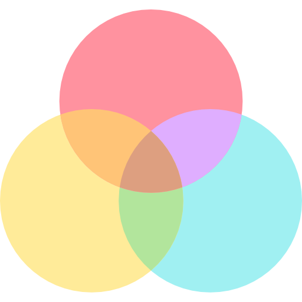

###
# My pICS

#### An app where you like or dislike pictures with a thumbs up or thumbs down.

#### You can watch your liked pictures on another page, where you also can delete or write notes if you select a specific picture.


> [mobilt_java24_erik_hultqvist_flutter_v_3](https://github.com/erihul/mobilt_java24_erik_hultqvist_flutter_v_3)

##  About the App

A simple and elegant Flutter app where you can **like or dislike randomly generated pictures**. Your liked images are saved and can be revisited, commented on, or deleted later.

---

##  Features

- 👍 Thumbs up to **like** an image
- 👎 Thumbs down to skip to a new image
- ❤️ Access all your liked images on a separate page
-  **Add personal comments** to saved pictures
-  **Delete** saved pictures
-  **Web support**:
    - Hover effects on icons and saved images
    - Subtle UI differences (flatter design, larger spacing)
-  **Mobile (Android) support**:
    - Material-styled buttons and animations
    - Long-press actions on saved images

---

##  Tech Stack

- **Flutter 3** (Web & Android)
- [`shared_preferences`](https://pub.dev/packages/shared_preferences) – for saving liked images and comments
- [`flutter_staggered_grid_view`](https://pub.dev/packages/flutter_staggered_grid_view) – for a Pinterest-style image layout
- [`google_fonts`](https://pub.dev/packages/google_fonts) – for a custom app bar font
- [`https://picsum.photos`](https://picsum.photos/) –  image-API, using endpoint for random pictures 

---

##  Structure Overview
```plaintext
lib/
├── main.dart           - Home screen with thumbs up/down logic
├── SecondPage.dart     - Page to manage liked/saved pictures

images/                 - Icon and Screenshots for README
```
---

##  Platform differences
- **Navbar**
    - Android  
    Takes less space  
    Smaller font
    - Web  
    Bigger  
    Larger Font
- **Buttons**
    - Android  
    Hoover&click-effect
    - Web  
    Click-effect
- **SavedImage-options**
    - Android  
    Visible on hoovered saved-image
    - Web  
    Displayed on long-pressed saved-image


---
> _Developed as part of the Java24 course Mobilutveckling med Java by Erik Hultqvist._